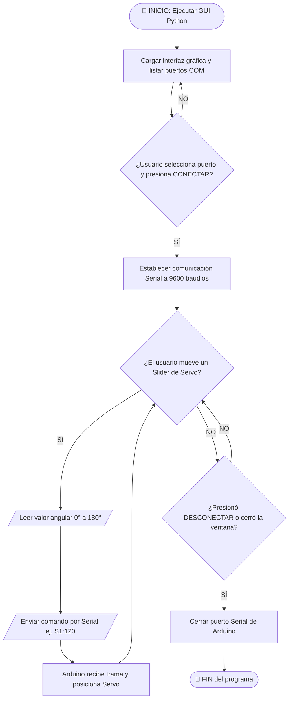

# Brazo Robótico 6-DOF

Este repositorio contiene el código de control y firmware para el brazo robótico de 6 grados de libertad.

## 📊 Diagrama de Flujo del Sistema

```mermaid
graph TD
    A([🚀 INICIO: Ejecutar GUI Python]) --> B[Cargar interfaz gráfica y listar puertos COM]
    B --> C{¿Usuario selecciona puerto y presiona CONECTAR?}
    
    C -- NO --> B
    C -- SÍ --> D[Establecer comunicación Serial a 9600 baudios]
    
    D --> E{¿El usuario mueve un Slider de Servo?}
    
    E -- SÍ --> F[/Leer valor angular 0° a 180°/]
    F --> G[/Enviar comando por Serial ej. S1:120/]
    G --> H[Arduino recibe trama y posiciona Servo]
    H --> E
    
    E -- NO --> I{¿Presionó DESCONECTAR o cerró la ventana?}
    
    I -- NO --> E
    I -- SÍ --> J[Cerrar puerto Serial de Arduino]
    J --> K([🛑 FIN del programa])
```
